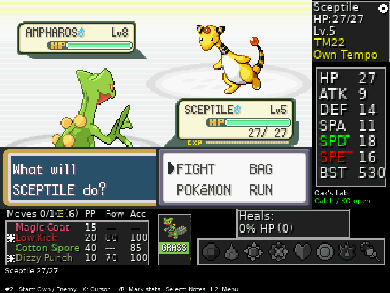
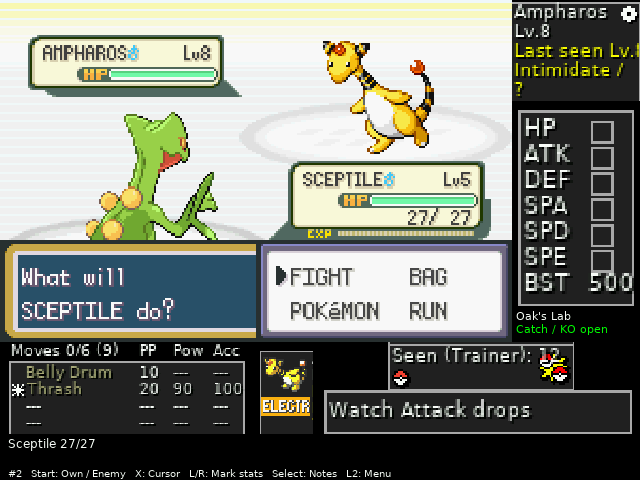
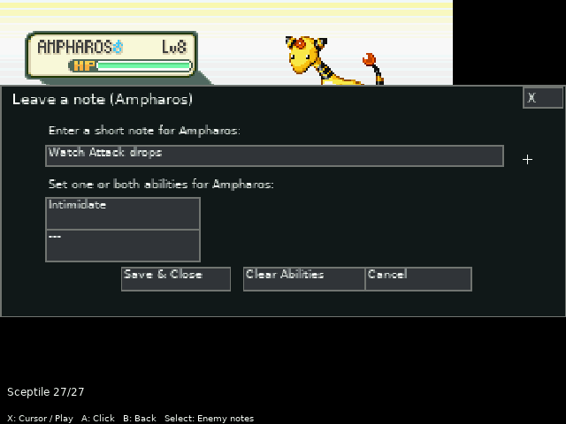
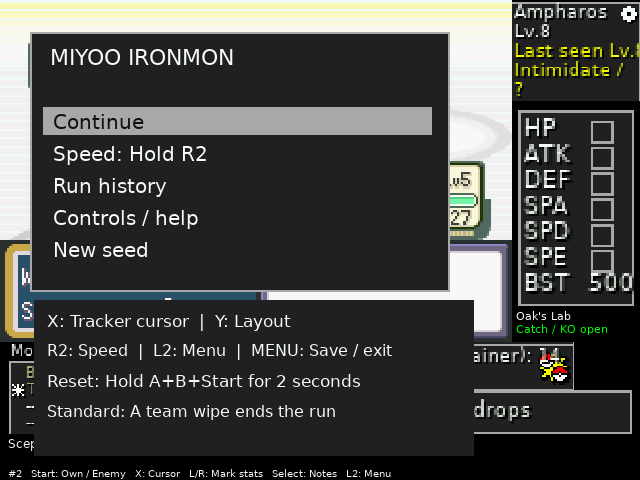

# Miyoo IronMON

**FireRed Standard IronMON. Original Tracker. Everything on your handheld.**

[**Download & install**](https://github.com/TrissyGE/miyoo-ironmon/releases/latest) · [Installation guide](INSTALL.md) · [Controls](#controls) · [Sources & credits](SOURCES.md)

Play, track, randomize and reset directly on a **Miyoo Mini Plus running Onion OS**.
An ARM frontend connects Onion's gpSP core to the **original Ironmon Tracker 9.4.0**,
with handheld controls, rearranged panels and Standard rule guards. Once installed,
you can play without a PC, Wi-Fi, Raspberry Pi or server.

## Get playing

1. Download **IronMON-Setup-Windows.zip** from the [latest release](https://github.com/TrissyGE/miyoo-ironmon/releases/latest) and extract it.
2. Shut down your Miyoo and connect its Onion SD card to your computer. Run **IronMON-Setup.exe**, select the SD card and your own **unmodified FireRed USA Rev 1** ROM. Select your GBA BIOS if it is not already on the card.
3. Click **Install IronMON**, safely eject the card, then open **Apps → IronMON**. The first launch prepares a seed; allow about 1–2 minutes.

No compilation, SSH, Python or host Java is needed for the Windows installer.
It downloads pinned upstream dependencies, checks their hashes, prepares your ROM
locally, and backs up an existing app before replacing it. Runs, notes and settings
are preserved. [Full instructions, updates and the Python option →](INSTALL.md)

Tested on **Miyoo Mini Plus / Onion v4.4.0-beta-20260120-07505ea5**.
Other Onion versions and the original Miyoo Mini have not been verified.
Releases contain no ROMs, BIOS files or saves; the installer never uploads them.

## Built for the Miyoo

- **More room for the game:** 512×342 by default, original Tracker panels to the right and underneath. Switch to exact 2× scaling, a large game view, or the complete original layout.
- **Familiar tracking:** original sprites, themes, move details, PP, stat stages, enemy stat markings, suspected abilities, notes, settings and an on-screen keyboard. Start switches between your Pokémon and the enemy.
- **Quick resets:** Faster FireRed 1.3.2, Oak intro skip, fixed names and two background-prepared seeds, each with a verified lab checkpoint after Mom. An empty cache needs time to refill.
- **Handheld conveniences:** hold/toggle fast forward, low-HP and poison warnings, a protected reset shortcut, autosave/resume, run history and eight completed-run backups by default.
- **Safer party handling:** encrypted records and checksums are checked before edits. Temporary party transitions are allowed to settle; persistent invalid data pauses play without recording a loss.
- **Safer bag guards:** complete quantities and currency are validated before edits. Menu/save key changes start a fresh comparison, preserving items you already own.

| Your Pokémon and stat stages | Enemy tracking and markings |
| --- | --- |
|  |  |
| **Suspected abilities and notes** | **Handheld menu and controls** |
|  |  |

These are actual frames from an isolated installation on the Miyoo using the real
gpSP core. They are not interface mockups.

## Standard rules, with guardrails

This release targets [**Standard IronMON**](https://gist.github.com/valiant-code/adb18d248fa0fae7da6b639e2ee8f9c1#standard-ironmon-ruleset).
Read the rules before playing; automation does not replace player responsibility.
A complete story playthrough has not been regression-tested.

- One catch **or** wild KO per location, shared across floors and methods; the additional shiny-KO exception is supported.
- New catches can be discarded before stats are shown. Scouts may throw balls; catches on used routes are discarded unseen.
- Death is permanent. Fainted Pokémon lose their held item and move to the last available PC boxes once the battle and menus finish. Healing cannot reactivate them.
- The run ends when the **entire team** faints. A single faint with a living teammate does not end Standard. Retry and Time Machine are disabled.
- Shops contain balls and Repels only. Extra purchase/barter guards, banned-item removal, trainer-rematch protection and hidden-item repeat protection are included.
- A starter is assigned before selection. Up to three favourites, including at most one legendary, can be configured in `settings.ini` using Gen 3 internal species IDs.
- Viridian's catching demonstration and the mandatory Tower ghost consume no encounter. The ghost still obeys normal death/item guards. Faster FireRed's optional friendship bonus is disabled.

A forbidden second wild KO, starter choice or trainer rematch stops the run with
a reason. Existing runs retain their data; earlier encounters never recorded by
an older version cannot be reconstructed. This release is not a Kaizo ruleset.

## Controls

| Button | Action |
| --- | --- |
| A / B / D-pad / Select | Game controls |
| Start | In battle: switch own Pokémon / enemy |
| X | Toggle Tracker cursor; D-pad moves, A clicks; game pauses |
| L1 / R1 | Select / mark enemy stat; also works in cursor mode |
| Select in cursor mode | Enemy notes and suspected abilities |
| B in cursor mode | Close dialog or return from details |
| Y | Default 512×342 → exact 480×320 → large game → original layout |
| L2 | Handheld menu; D-pad selects, A confirms, B closes |
| R2 | Hold fast forward; choose toggle mode in the L2 menu |
| MENU | Save and exit |
| Hold A+B+Start for 2 seconds | New seed; protected until the first battle is played |

Original detail/settings pages open as enlarged windows. Stat markings and notes
use the Tracker's own save format. Timer and Repel overlays remain available.
This custom emulator-API adapter does not fully reproduce desktop file pickers
or external integrations, and does not claim complete BizHawk feature parity.

## Data, support and development

`App/IronMON/data/current.*` is the current run; `current.rules` stores the rule
journal, `history.tsv` the history, and `data/runs/` completed backups.
MENU exit saves immediately; autosave runs every minute. Sudden power loss can
lose progress since the last save. Backups are for recovery; Standard offers
no in-game rewind to completed runs.

For bugs, include the location, action, release/Onion versions and relevant lines
from `data/frontend.log` or `data/cache-worker.log`. Do not attach ROMs, BIOS,
saves or randomized-ROM logs. [Report a bug →](https://github.com/TrissyGE/miyoo-ironmon/issues/new/choose)

[Build & test](BUILD.md) · [Contributing](CONTRIBUTING.md) · [Changelog](CHANGELOG.md)

## Credits, licensing and AI use

The original Tracker is by [besteon and contributors](https://github.com/besteon/Ironmon-Tracker).
Randomization uses [UPR ZX](https://github.com/Ajarmar/universal-pokemon-randomizer-zx),
QoL preparation uses [DrMaple's Faster FireRed](https://github.com/DrMaple/Faster-FireRed)
and an adapted intro routine, and emulation uses Onion's [gpSP](https://github.com/libretro/gpsp).
[All sources, pinned versions and research references →](SOURCES.md)

**This project's custom code was substantially developed with OpenAI Codex.**
AI wrote much of the frontend, adapter, rule guards, installer, tests and documentation.
The human owner directed the design and tested on real hardware. The scope and
validation limits are disclosed in [AI_USAGE.md](AI_USAGE.md).

The custom port is **GPL-3.0-only**. Upstream components retain their own licenses;
see [LICENSE](LICENSE) and [third-party notices](THIRD_PARTY_NOTICES.md).
An unofficial community project, unaffiliated with Nintendo, Game Freak,
The Pokémon Company, IronMON, the Tracker project or Onion.
